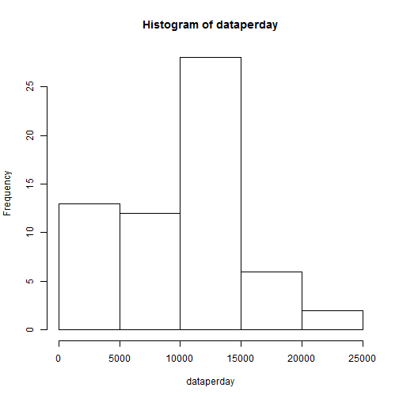
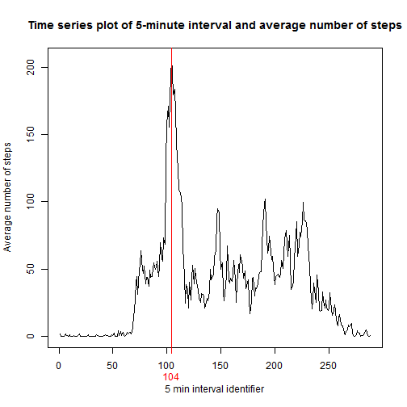
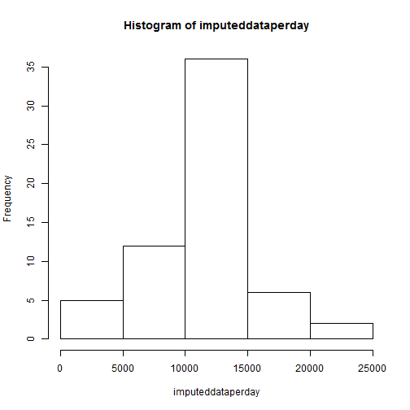
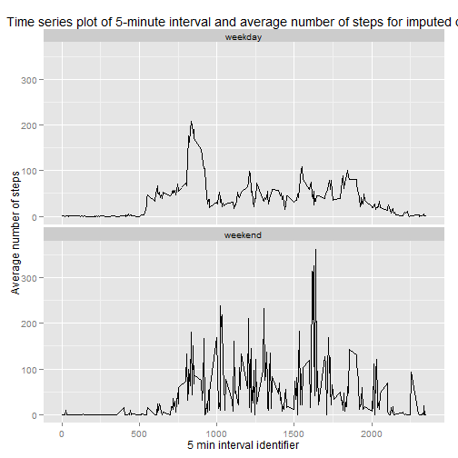

# Reproducible Research: Peer Assessment 1


## Loading and preprocessing the data


```r
data<-read.csv("C:/Users/Arvind/githublocal/RepData_PeerAssessment1/activity.csv")
data$date<-as.Date(data$date,"%Y-%m-%d")
```

## What is mean total number of steps taken per day?


```r
dataperday<-tapply(data$steps,data$date,sum,na.rm=T)
```

Making a histogram of the total number of steps taken each day for original dataset


```r
hist(dataperday)
```

 

Calculating mean and median for total number of steps taken each day for original dataset


```r
meanfordataperday<-mean(dataperday,na.rm=T)
medianfordataperday<-median(dataperday,na.rm=T)
```

Mean and median total number of steps taken per day for original dataset are 9354.2295 and 10395, respectively.

## What is the average daily activity pattern?


```r
dataper5min<-tapply(data$steps,data$interval,mean,na.rm=T)

plot(dataper5min,type="l",xlab="5 min interval identifier", ylab="Average number of steps",main="Time series plot of 5-minute interval and average number of steps")
abline(v=which.max(dataper5min),col="red")
axis(1,col="red",col.axis="red",at=which.max(dataper5min),mgp = c(10, 2, 0))
```

 

```r
maxsteps5min<-which.max(dataper5min)
```

"104" 5-minute interval, on average across all the days in the dataset, contains the maximum number of steps.

## Imputing missing values

Calculating the number of rows with missing values


```r
missingvalue<-sum(is.na(data$steps))
```

Total number of observation with missing values in steps is 2304.

Filling in all missing values in dataset with mean for corresponding 5-min interval and creating a new dataset


```r
dataper5min<-data.frame(rownames(dataper5min),dataper5min)
names(dataper5min)<-c("interval","meansteps")
imputeddata<-merge(data,dataper5min,by="interval")
imputeddata$newsteps<-ifelse(is.na(imputeddata$steps),imputeddata$meansteps,imputeddata$steps)
```

Making a histogram of the total number of steps taken each day for imputed dataset


```r
imputeddataperday<-tapply(imputeddata$newsteps,imputeddata$date,sum)
hist(imputeddataperday)
```

 

Calculating and reporting the mean and median total number of steps taken per day for imputed dataset


```r
meanforimputeddataperday<-mean(imputeddataperday)
medianforimputeddataperday<-median(imputeddataperday)
```

Mean and median total number of steps taken per day for imputed dataset are 1.0766 &times; 10<sup>4</sup> and 1.0766 &times; 10<sup>4</sup>, respectively.

Do these values differ from the estimates from the first part of the assignment? What is the impact of imputing missing data on the estimates of the total daily number of steps?

Mean and median values for original data are smaller than mean and median values for imputed data. Imputation of missing values, by using the mean for corresponding 5-minute interval, overestimates the mean and median values for total number of steps taken per day. 

## Are there differences in activity patterns between weekdays and weekends?

Creating a new factor variable in the dataset with two levels - "weekday" and "weekend" indicating whether a given date is a weekday or weekend day


```r
imputeddata$weekday<-weekdays(imputeddata$date)
imputeddata$weekday<-ifelse(imputeddata$weekday==c("Satureday","Sunday"),"weekend","weekday")
```

Making a time series plot of 5-minute interval and average number of steps for imputed data


```r
imputeddataper5min<-aggregate(newsteps~interval+weekday,FUN=mean,data=imputeddata)
library(ggplot2)
```

```
## Warning: package 'ggplot2' was built under R version 3.0.3
```

```r
ggplot(imputeddataper5min,aes(x=interval,y=newsteps))+
  facet_wrap(~weekday,nrow=2)+
  geom_line()+
  labs(x="5 min interval identifier")+
  labs(y="Average number of steps")+
  labs(title="Time series plot of 5-minute interval and average number of steps for imputed data")
```

 
